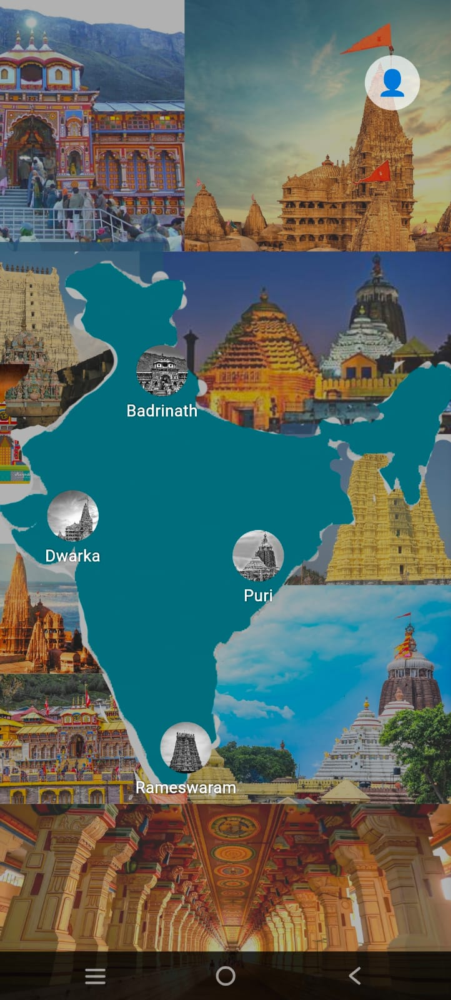
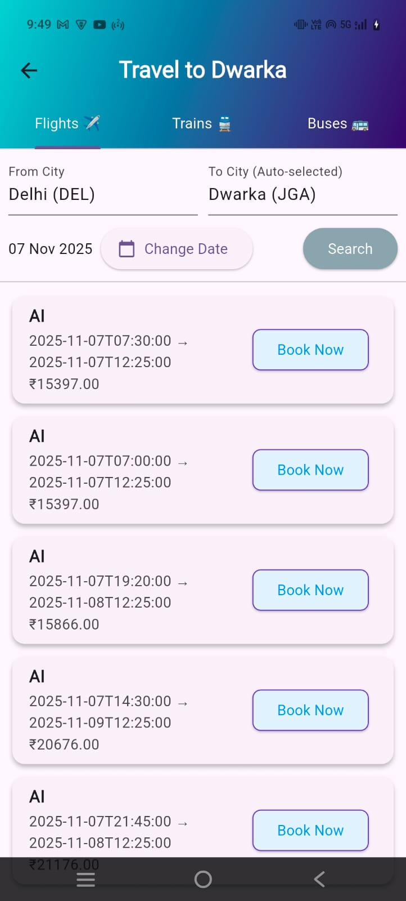
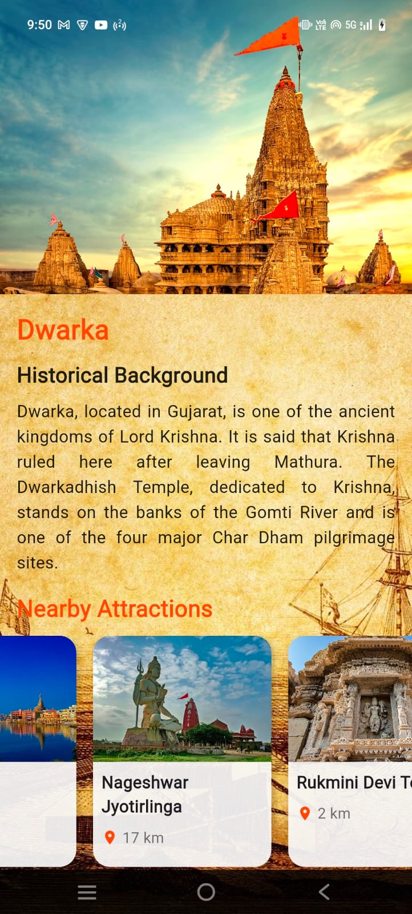
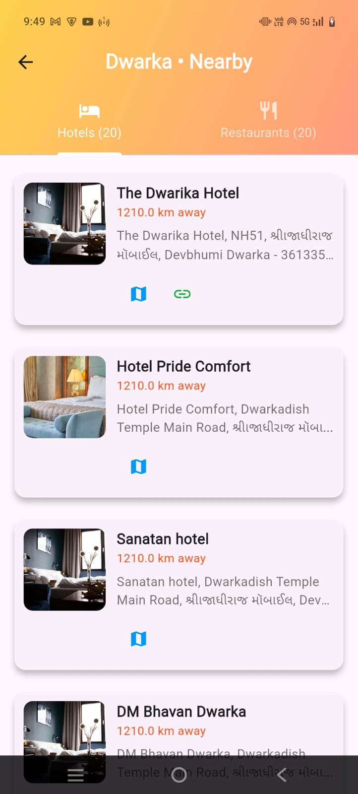
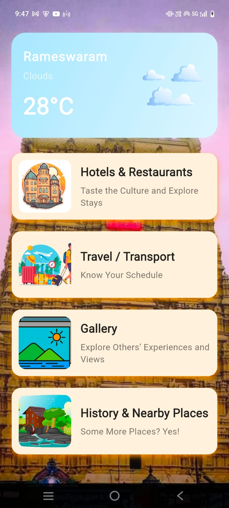
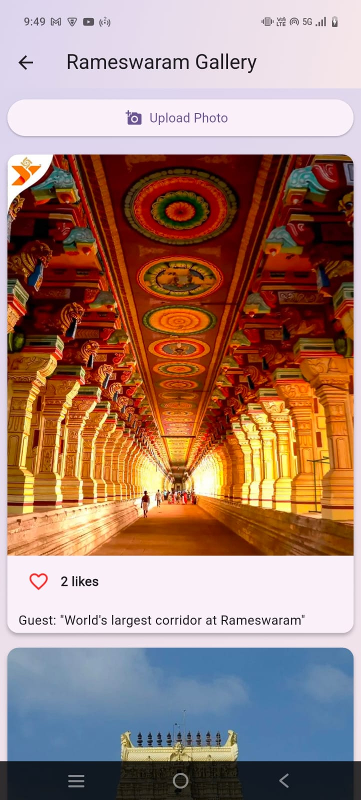

# 🛕 YatraSathi – Chardham Trip Planning App

  <b>Your Smart Travel Companion for the Sacred Chaar Dham Yatra</b>

---

## 📖 Overview

**YatraSathi** is a full-stack mobile application built using **Flutter** to simplify planning and exploring the **Chaar Dham pilgrimage**. The app enables users to discover destinations, explore nearby attractions, find hotels and restaurants, upload travel memories, and access travel-related information through a clean and intuitive interface.

---

## ✨ Features

- 🛕 Explore all Chaar Dham destinations
- 🗺️ View detailed travel information
- 📍 Discover nearby tourist attractions
- 🏨 Browse nearby hotels and restaurants
- 📸 Upload and explore travel memories in the gallery
- 🔍 Search destinations with an interactive interface
- ☁️ Cloud-based image storage using Cloudinary
- 🌐 REST API integration for dynamic content
- 📱 Responsive and user-friendly Flutter UI

---

# 📱 Application Screenshots

## 🔐 Login Screen

Secure user authentication with a simple and intuitive login interface.

---

## 🏠 Home (Destination) Screen

Browse Chaar Dham destinations and navigate throughout the application.

---

## 🚗 Travel Screen

Plan your journey with destination information and travel guidance.

---

## 🏛️ History Screen

Learn about the historical significance of each Chaar Dham destination.

---

## 📍 Hotels & Nearby Places

Discover nearby hotels, restaurants, and tourist attractions.

---

## 🛕 Dham Information

Explore detailed information about each sacred destination.

---

## 🖼️ Gallery Screen

Upload and browse memorable moments from your pilgrimage.

---

# 🛠 Tech Stack

### Frontend
- Flutter
- Dart

### Backend
- Node.js
- Express.js

### Database
- MongoDB

### APIs & Services
- Geoapify API
- Pixabay API
- Cloudinary
- REST APIs

---

# 🔮 Future Enhancements

- 🤖 AI-based personalized trip planner
- 💳 Hotel booking & payment gateway
- 🚑 Emergency contacts and SOS support
- 📴 Offline map support
- ⭐ Ratings and reviews

---

# 👩‍💻 Developer

**Akshara Chauhan**

📧 Email: **akshaaraa28@gmail.com**

🔗 GitHub: https://github.com/akshara-001

---

## ⭐ Support

If you found this project useful, please consider **starring ⭐ the repository**.

Made with ❤️ using Flutter.
